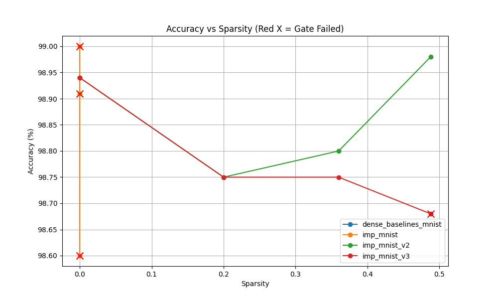

# TicketSmith Executive Summary

## Recommendation

**Safe Optimisation Zone**: Up to **48.8% sparsity**.
Best variant: imp_mnist_v2 (Round 3).
Speedup: 515.4 img/s (BS1) vs baseline.

## Quality Gate Table

| Experiment            |   Round |   Sparsity |   Accuracy | GatePassed   | GateReasons                          |
|:----------------------|--------:|-----------:|-----------:|:-------------|:-------------------------------------|
| dense_baselines_mnist |       0 |   0        |      98.94 | True         | Baseline                             |
| imp_mnist             |       0 |   0        |      98.94 | True         | Baseline                             |
| imp_mnist             |       1 |   0        |      98.6  | False        |                                      |
| imp_mnist             |       2 |   0        |      98.91 | False        |                                      |
| imp_mnist             |       3 |   0        |      99    | False        |                                      |
| imp_mnist_v2          |       0 |   0        |      98.94 | True         | All signals within thresholds        |
| imp_mnist_v2          |       1 |   0.199999 |      98.75 | True         | All signals within thresholds        |
| imp_mnist_v2          |       2 |   0.359999 |      98.8  | True         | All signals within thresholds        |
| imp_mnist_v2          |       3 |   0.487999 |      98.98 | True         | All signals within thresholds        |
| imp_mnist_v3          |       0 |   0        |      98.94 | True         | All signals within thresholds        |
| imp_mnist_v3          |       1 |   0.199999 |      98.75 | True         | All signals within thresholds        |
| imp_mnist_v3          |       2 |   0.359999 |      98.75 | True         | All signals within thresholds        |
| imp_mnist_v3          |       3 |   0.487999 |      98.68 | False        | Loss delta 36.61% exceeds max 10.00% |

## Serving Scorecard (Benchmark)

| Experiment            |   Sparsity |   Latency_BS1 |   Throughput_BS1 |   Throughput_BS32 |
|:----------------------|-----------:|--------------:|-----------------:|------------------:|
| dense_baselines_mnist |   0        |      0        |            0     |              0    |
| imp_mnist             |   0        |      0        |            0     |              0    |
| imp_mnist             |   0        |      0        |            0     |              0    |
| imp_mnist             |   0        |      0        |            0     |              0    |
| imp_mnist             |   0        |      0        |            0     |              0    |
| imp_mnist_v2          |   0        |      1.03822  |          963.187 |           6397.28 |
| imp_mnist_v2          |   0.199999 |      1.24301  |          804.496 |           4400.55 |
| imp_mnist_v2          |   0.359999 |      1.22909  |          813.61  |           5991.94 |
| imp_mnist_v2          |   0.487999 |      1.94019  |          515.415 |           5084.05 |
| imp_mnist_v3          |   0        |      0.869935 |         1149.51  |           6466.93 |
| imp_mnist_v3          |   0.199999 |      1.27394  |          784.963 |           4848.12 |
| imp_mnist_v3          |   0.359999 |      0.618745 |         1616.17  |           9194.2  |
| imp_mnist_v3          |   0.487999 |      0.638795 |         1565.45  |           8672.65 |

## Visualizations

